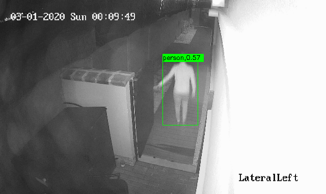
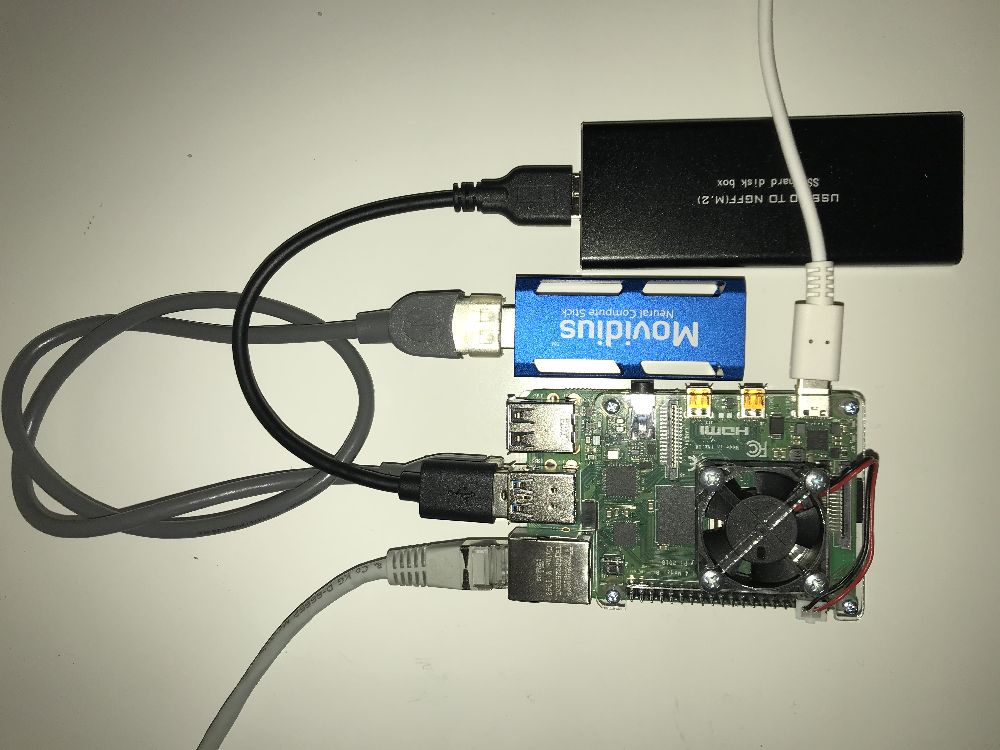
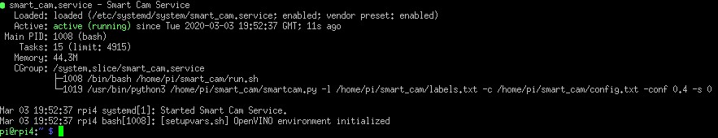
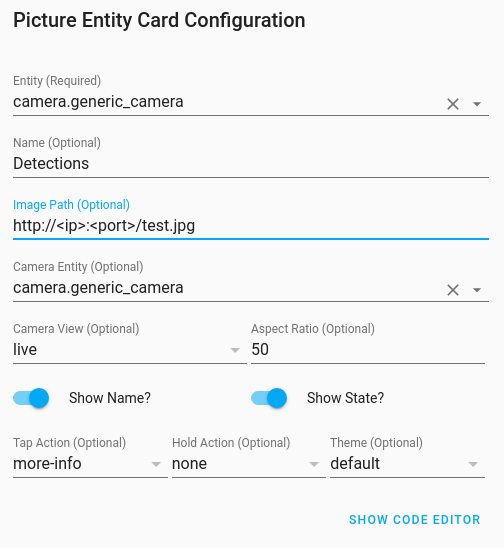

# Smart camera for home surveillance

## About

The project brings the usual IP cameras to the next level, adding deep neuronal networks for object detection and classification, using mobilenet-ssd detector with openvino framework. Works on Raspberry Pi4, using CPU or a NCS 1 compute stick. Suitable for home automatization or IoT applications for smart houses. The implementation works also with attached USB camera, see next section for available commands.

<p align="center"> 
</a>
</p>

### Configuration file

Before usage, the configuration file parameters must be adjusted to the needs (i.e. IP address of the cameras, ONVIF address to grab a picture, right credentials must be entered). Take a look in ./config.txt file

### Command line parameters

```
python3 ./smartcam.py --help
usage: smartcam.py [-h] [-cam camera] [-l labelfile] -c config
                   [-s showdetections] [-conf confidence] [-si showcmdinfo]
                   [-img loadimage] [-server servdata]

optional arguments:
  -h, --help         show this help message and exit
  -cam camera        use usb cam, id=[None,0,1,2,3], default=None - IPCams
                     will be used
  -l labelfile       label file, like ./labels.txt
  -c config          config file, holds the access credentials, urls, like
                     ./config.txt
  -s showdetections  show/ hide detection window [0,1], default=0
  -conf confidence   confidence value [0.0 - 1.0], default=0.8
  -si showcmdinfo    show cmd line info on detection, default=False
  -img loadimage     load an image, provide the path like ./test.jpg
  -server servdata   Use the selected server to publish detections [http,
                     mqtt, all], must be configured in config file.
```

## Running on Raspberry Pi4 with Openvino and NCS v1

Requirements:
- Raspberry Pi4B, with [buster](https://www.raspberrypi.org/downloads/raspbian/) version
- Intel TM Movidius Neuronal [Compute Stick](https://software.intel.com/en-us/articles/intel-movidius-neural-compute-stick)
- (optional) USB3.0 M.2 SSD 
- 16/32 Gb SSD card
- Openvino + OpenCV installaion [2019R31](https://docs.openvinotoolkit.org/latest/_docs_install_guides_installing_openvino_raspbian.html#workflow-for-raspberry-pi), note: I had troubles using the latest version (model generated on PC with Model Optimizer was not working on RPi4).
- (optional) [ncappzoo](https://github.com/movidius/ncappzoo) for additional models and gideline for Model Optimizer installation (MO) on RPi4. The recommandation is to use a PC (instead Rpi4) with Openvino intallation to transform and optimize state-of-the-art models, then deplyoy on RPi4. 
- To grab the pictures from IP cameras the 'requests' pip package was intalled.

<p align="center"> 
</a>
</p>

### Running the application on RPi4 startup

Extra steps are needed on Rpi4 if we want to run the smart_cam application on boot time. The method presented will create a service, which provides easy methos for start / stop / enable the application.

#### Load openvino environment and smart_cam on boot

Use your favorite text editor to create a file
nano -w /home/pi/smart_cam/run.sh
```
. /opt/intel/openvino/setupvars.sh # source the environment varialbles
/usr/bin/python3 /home/pi/smart_cam/smartcam.py -l /home/pi/smart_cam/labels/txt -c /home/pi/smart_cam/config.txt -conf 0.7 -s 0
```
Save and make it executable.
```
chmod +x /home/pi/smart_cam/run.sh
```
Please note the absolute paths used in the run script, will not work with relative ones. Info mesages are deactivated (see -s 0 and config file paramentes). Next step is to create the service and enable it.
```
sudo nano -w /etc/systemd/system/smart_cam.service
```
Fill with the following content and save it.
```
[Unit]
Description=Smart Cam Service
After=network.target

[Service]
Type=idle
EecStart=/bin/bash/ /home/pi/smart_cam
WorkingDirectory=/home/pi/smart_cam
StandardOutput=inherit
StandardError=inherit
User=pi

[Install]
WantedBy=multi-user.target
```
Now, start the service to test it.
```
sudo systemctl start smart_cam.service
```
If everiting is fine, you will see something like this:
<p align="center"> 
</a>
</p>
Now, it can be enabled to start on boot time:

```
sudo systemctl enable smart_cam.service
```

## Running on PC

To run on a PC, the above mentioned requirements are valid. Openvino with OpenCV. Here for testing purposes, the 'target' atribut from the configuration file could be settled to 'cpu' mode. USB camera (if atteched), can be invoked easily with the command line parameter.

## IOT integration

Thre are two methods provided to integrate in an IOT system:
- http server - servs the detections
- mqtt client - sends images to an mqtt broker

Both can work together, the http server is usefull to verify easily the detections, responds to GET requests, so refresh is needed after detections.
If the chooesen option is the mqtt client, additional package is needed to be intalled. Recommanded is to use the [Paho MQTT Python Client](http://www.steves-internet-guide.com/into-mqtt-python-client/). The advantage using mqtt, is that additional information is provided beside the picture with detections: 
- status - indicates if the sensor is alive
- labels - detection and detection accuracy is available in a string format - provideing more posibilities to filter the topic of interest
- picture with detection (same as with http solution)

Before use this features, additional configuration si needed in the config.txt file:
```
#set mqtt connection parameters
mqttbroker=<smart_cam IP>
mqttport=1883
mqttstatustopic=/smart_cam/status
mqttlabelstopic=/smart_cam/labels
mqttdetections=/smart_cam/detections

#set http server parameters (to serve detections), 
#use: http://<ip>:8080/test.jpg - responds only to GET requests (new detection needs browser refresh)
hostip=<smart_cam IP>
hostport=8080
```

### Home Assistant integration

Using [Home Assintant](https://www.home-assistant.io/) as IOT platform, easy integration is avavilable for both solutions. After integration, a live stream of detections is provided.

#### Integrating the http server

In the configuration.yaml file add the followings:
```
camera:
  - platform: generic
    still_image_url: http://<smart cam IP>:<smart cam port>/test.jpg
    stream_source: http://<smart cam IP>:<smart cam port>/test.jpg
```
On hte home assistant graphical interface add Picture Entity Card Configuration with the following settings:
<p align="center"> 
</a>
</p>

#### Integrating the mqtt client

In the configuration.yaml file add the followings:
```
sensor:
  - platform: mqtt
    name: "smart_sensor"
    state_topic: "/smart_cam/labels"
    availibility_topic: "/smart_cam/status"
    payload_available: "ON"
    payload_not_available: "OFF"
```
and
```
camera:
  - platform: mptt
    topic: /smart_cam/detections
    name: smart_cam
```
Usa a Picture Glance Card Configuration with the following settings:
<p align="center"> 
</a>
</p>

## Resurces

https://docs.openvinotoolkit.org/latest/_docs_install_guides_installing_openvino_raspbian.html#workflow-for-raspberry-pi

https://github.com/movidius/ncappzoo

https://github.com/chuanqi305/MobileNet-SSD

https://www.raspberrypi.org/documentation/linux/usage/systemd.md

